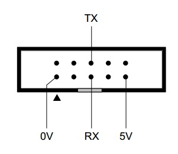
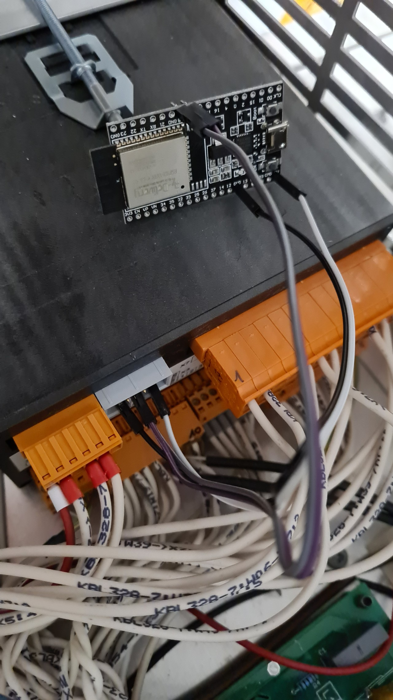

# ESPHome Components For Hermes 40LG040100

This repository provides ESPHome external components for Hermes 40LG040100 ventilation and heat-pump controllers.


## LG250 Status: Read-Only Integration

The tested Pichler LG250 is useful in Home Assistant as a read-only integration. This repository reliably reads selected temperatures, fan speeds, control voltages, ventilation-level setpoints, the current ventilation level, and diagnostic status/error values from the controller's native serial interface.

The controller accepts some write frames with `ACK`, but the tested LG250 does not persist the requested value: immediate readback remains unchanged. Other control attempts, including the RS handshake and room-setpoint write, return `NAK`. No safe and reproducible control path has been identified, so the maintained LG250 configuration is intentionally read-only.

Detailed field evidence, hardware context, protocol traces, Modbus/KNX/BACnet comparisons, and the unresolved write-path investigation are recorded in [code-status-lg250.md](code-status-lg250.md). Contributions are welcome, especially documented controller variants, raw captures from the panel or official PC software, wiring evidence, or a repeatable sequence that makes a write persist. Please do not submit guessed reset, save, watchdog, or relay commands as a control solution.

The tested Pichler LG250 uses a native Hermes two-character command protocol over `9600 7E1` serial, not generic Modbus register addressing. The protocol framing uses ASCII command bytes, `EOT`/`STX`/`ETX` control characters, and an XOR checksum for writes. Register availability and write permissions are firmware- and model-dependent.

## What 40LG040100 Means

In the context of Hermes Electronic and a Pichler KWL (controlled residential ventilation) system, `40LG040100` refers to the part number or board designation of the central control unit (main PCB) of the ventilation device.

In this context, the designation can be interpreted as follows:

- `40LG040100`: Official Pichler article number for the electronic control component. Pichler uses the `LG` product identifier for ventilation unit families in their article and spare-part numbering (for example LG 150, LG 250, LG 350, LG 450).
  - Source: https://www.pichlerluft.de/dezentral-wohnungsweise-lueftungsgeraete-de.html
- Hermes Electronic: Hermes Electronic GmbH is a German OEM and specialized manufacturer for industrial and HVAC electronics. They manufacture controller boards for multiple building-technology brands (including Pichler, and also Schworer or Zimmermann).
  - Sources:
    - https://www.spares4less.com/1303031-OVP?srsltid=AfmBOooZJlDPIZvLUtejON3beq9zFFNFewZ7dVOxPvmJiNBIsM869pNW
    - https://community.symcon.de/t/abfragen-und-regeln-der-lueftungssteuerung-wr-3223-von-hermes-electronic/35008

### Typical Use And Capabilities

The controller board regulates core functions of a Pichler ventilation unit:

- Fan control: Timing and speed supervision of supply and extract air fans (often constant-volume-flow control)
- Bypass damper: Automatic summer bypass control for night cooling
- Sensor evaluation: Processing internal or external humidity, CO2, or VOC sensor data
- Interfaces: Communication with the external control panel (for example Pichler touch display) and often an internal service interface (RS232/RS485) for diagnostics

Sources:

- https://community.symcon.de/t/abfragen-und-regeln-der-lueftungssteuerung-wr-3223-von-hermes-electronic/35008
- https://www.pichler.si/wp-content/uploads/2023/05/08LG500P_PHI-zertifiziert.pdf

## Project Reference

Original component idea and protocol groundwork:

- https://github.com/schmurgel-tg/esphome-components

Many thanks to this cool work!

## Feature Summary

- Read confirmed LG250 temperatures, fan RPMs, control voltages, heat-recovery value, and per-level setpoints
- Read and publish the current ventilation level and raw diagnostic status/error values
- Derive a Home Assistant status text from confirmed `LS` readback
- Decode the confirmed error-register values into readable diagnostics
- Keep all active LG250 controller communication passive: no level, mode, setpoint, reset, relay, or save writes

## Requirements

- ESPHome (Home Assistant add-on or standalone)
- ESP32/ESP8266 connected to controller UART
- Serial settings:
  - Baud rate: `9600`
  - Data bits: `7`
  - Parity: `EVEN`
  - Stop bits: `1`

Reference pinout image:



## Installation

Add this repository as an external component source in your ESPHome YAML:

```yaml
external_components:
  - source:
      type: git
      url: https://github.com/gelbetomate/40LG040100
      # ref: main
    components: [40lg040100]
    refresh: always
```

## Minimal Recommended Configuration

```yaml
external_components:
  - source:
      type: git
      url: https://github.com/gelbetomate/40LG040100
    components: [40lg040100]
    refresh: always

uart:
  - id: uart_bus
    tx_pin: GPIO19
    rx_pin: GPIO18
    baud_rate: 9600
    data_bits: 7
    parity: EVEN
    stop_bits: 1

40lg040100:
  uart_id: uart_bus
  enable_unsafe_writes: false

sensor:
  - platform: 40lg040100
```

## Confirmed LG250 Read-Only Example

```yaml
40lg040100:
  uart_id: uart_bus
  enable_unsafe_writes: false
  enable_rs_handshake: false

sensor:
  - platform: 40lg040100
    sensors_custom:
      - command: "T1"
        name: "LG250 Exhaust Air Temperature"
        unit_of_measurement: "°C"
        device_class: temperature
        state_class: measurement
      - command: "NA"
        name: "LG250 Extract Fan Speed"
        unit_of_measurement: "rpm"
        state_class: measurement
      - command: "NZ"
        name: "LG250 Supply Fan Speed"
        unit_of_measurement: "rpm"
        state_class: measurement

text_sensor:
  - platform: 40lg040100
    text_sensors_custom:
      - command: "LS"
        name: "LG250 Current Ventilation Level"
      - command: "ST"
        name: "LG250 Raw Status Register"
```

## Write Access On The Tested LG250

Keep `enable_unsafe_writes: false` for the tested LG250. The maintained `lg250-esp.yaml` exposes no write-capable controller entity.

For the tested Pichler LG250 interface, the following behavior is confirmed:

| Command | Access | Confirmed behavior |
|---|---|---|
| `LS` | Read | Current ventilation level; `4` represents base ventilation on the tested unit |
| `MD` | Read | Operation mode readback is not available on the tested firmware |
| `L1` | Read | Controller accepts test writes with `ACK`, but readback remains `20`; no persistent write confirmed |
| `L2` | Read | Controller accepts test writes with `ACK`, but readback remains `33`; no persistent write confirmed |
| `L3` | Read | Controller accepts test writes with `ACK`, but readback remains `68`; no persistent write confirmed |
| `Rd` | Read only | Room-temperature setpoint can be read, but `Rd` writes receive `NAK` |
| `SW`, `RS` | Not confirmed for this interface | Writes receive `NAK`; do not enable the RS/PC-control handshake by default |

`L1`/`L2`/`L3` are readable setpoint registers. On the tested LG250, write frames receive `ACK`, but test writes to all three registers are followed by the previous values on readback (`L1=20`, `L2=33`, `L3=68`). The component treats readback, not `ACK` alone, as confirmation. The active level remains observable through `LS`; it is not controllable through this maintained LG250 profile.

## Validation Focus

The practical priority for the LG250 is reliable passive operation: stable reads, plausible units, correct air-path naming, and status derived only from confirmed readbacks.

## Register Coverage Strategy

The component is not limited to a fixed WR3223-only entity subset. It is designed to expose as many controller registers as possible:

- Numeric registers via `sensor.sensors_custom` (`command: ".."`)
- Text/raw registers via `text_sensor.text_sensors_custom` (`command: ".."`)

### Generic Component And Model-Specific YAML

The C++ component is intended to remain generic across Hermes/Pichler controller variants such as LG150, LG250, and LG350. It should provide protocol framing, command transport, numeric parsing, checksum handling, and reusable read/write primitives.

Model- and firmware-specific knowledge belongs in the YAML configuration or a model profile:

- which commands are enabled and polled
- labels and HVAC terminology such as supply air, extract air, and exhaust air
- scaling and valid ranges
- whether a command is read-only or writable on the target firmware
- derived status interpretations and UI entities

The current `lg250-esp.yaml` is therefore a field-tested LG250 configuration, not the universal definition of every `40LG040100` controller. A command returning `??????.` on one unit must remain a firmware-specific observation until another model is tested. Likewise, an `ACK` for `L1` or `L3` on the LG250 does not prove the same write permission on an LG150 or LG350.

Example for broad register access:

```yaml
sensor:
  - platform: 40lg040100
    sensors_custom:
      - command: "LS"
        name: "Current Ventilation Level"
        unit_of_measurement: "level"

text_sensor:
  - platform: 40lg040100
    text_sensors_custom:
      - command: "ER"
        name: "Raw Error Register"
      - command: "ST"
        name: "Raw Status Register"
```

Optional profile-based defaults for model families:

```yaml
sensor:
  - platform: 40lg040100
    reference_profile: lg250  # one of: none, lg150, lg250, lg350

text_sensor:
  - platform: 40lg040100
    reference_profile: lg250
```

All custom register commands must be exactly two alphanumeric characters, matching the controller protocol command format.

## Additional Field References

The following community references are useful for expanding function coverage, especially for LG150/LG250/LG350 device families:

- https://www.loxforum.com/forum/german/software-konfiguration-programm-und-visualisierung/12220-hilfe-bei-einbindung-einer-l%C3%BCftungsanlage-pichler-lg-180-250
- https://gist.github.com/lewurm/6ab5a914209e8a16f4532ccfcd25b865
- https://forum.fhem.de/index.php?topic=81153.0

### Practical Function Candidates From These Sources

The references repeatedly mention these control and telemetry capabilities:

- Operation mode summer/winter
- Ventilation level selection (standby, level 1/2/3, base ventilation)
- Per-level airflow setpoints (stage 1/2/3)
- Bypass status and bypass force mode
- Supply/extract fan RPM
- Airflow (m3/h) supply/extract
- Temperature channels (outside/return/supply and derived values)
- Filter runtime / maintenance indicators
- Error/status bitfields

### Notes For This Component

- This repository currently speaks the native 2-character controller command protocol (not generic Modbus register addressing).
- The Modbus community mappings are still valuable as validation references for expected behavior and semantics.
- The official Hermes interface references document command names and access rights, but they may describe a different controller variant. Treat them as protocol references and verify behavior on the target LG250 firmware.
- Cross-model scaling and write permissions can differ. The tested LG250 reads `L1`/`L2`/`L3` in the observed `0..100%` range, but does not persist tested writes; do not enable write automations from these values.
- `Rd` is exposed as a read-only room-temperature setpoint on the tested LG250. It must not be configured as a writable Number unless a future firmware-specific test confirms that path.

### Suggested Safe Rollout

- Start with read-only custom sensors/text sensors for candidate commands.
- Validate ranges, units, and stability for several days.
- For the tested LG250, keep controller writes disabled unless a repeatable write/readback/persistence test proves the entire control path on your hardware.

## Upstream UI Reference Screenshots

The following screenshots originate from the upstream WR3223-oriented component and are not evidence for the tested LG250 write path. They are kept only as a generic UI reference.


Wiring example from Smurgel:



