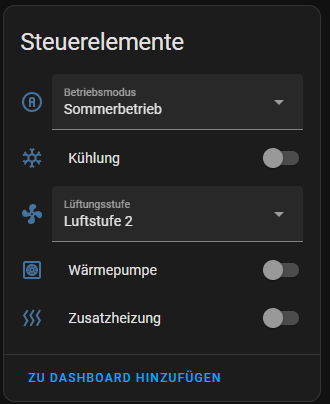
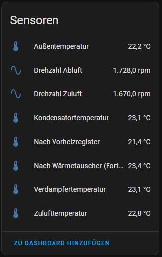
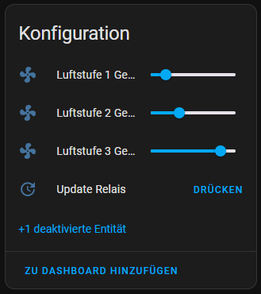
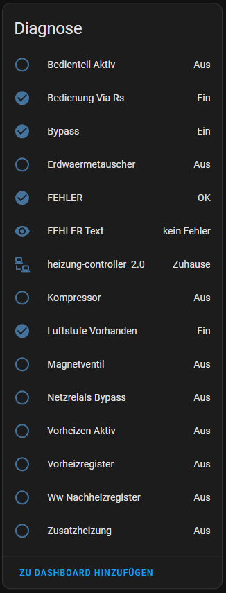

# ESPHome Components For Hermes 40LG040100

This repository provides ESPHome external components for Hermes 40LG040100 ventilation and heat-pump controllers.


This is work in progress. Please test with care and don't expect it to work at all.
There is a differnce in the WRS3223 and the 40LG040100 in the codes to be used. But the interface itself seems to be the same. The technical setup for ESPHome worked and I can read some of the values from my Pichler LG250 but not all. As it was not possible to get all data with ESPHome configuration I decided to make a copy of smurgels implementation and trim this to my needs.

## What 40LG040100 Means

In the context of Hermes Electronic and a Pichler KWL (controlled residential ventilation) system, `40LG040100` refers to the part number or board designation of the central control unit (main PCB) of the ventilation device.

In this context, the designation can be interpreted as follows:

- `40LG040100`: Official Pichler article number for the electronic control component. Pichler uses the `LG` product identifier for ventilation unit families in their article and spare-part numbering (for example LG 150, LG 250, LG 350, LG 450).
  - Source: https://www.pichlerluft.de/dezentral-wohnungsweise-lueftungsgeraete-de.html
- Hermes Electronic: Hermes Electronic GmbH is a German OEM and specialized manufacturer for industrial and HVAC electronics. They manufacture controller boards for multiple building-technology brands (including Pichler, and also Schworer or Zimmermann).
  - Sources:
    - https://www.spares4less.com/1303031-OVP?srsltid=AfmBOooZJlDPIZvLUtejON3beq9zFFNFewZ7dVOxPvmJiNBIsM869pNW
    - https://community.symcon.de/t/abfragen-und-regeln-der-lueftungssteuerung-wr-3223-von-hermes-electronic/35008

### Typical Use And Capabilities

The controller board regulates core functions of a Pichler ventilation unit:

- Fan control: Timing and speed supervision of supply and extract air fans (often constant-volume-flow control)
- Bypass damper: Automatic summer bypass control for night cooling
- Sensor evaluation: Processing internal or external humidity, CO2, or VOC sensor data
- Interfaces: Communication with the external control panel (for example Pichler touch display) and often an internal service interface (RS232/RS485) for diagnostics

Sources:

- https://community.symcon.de/t/abfragen-und-regeln-der-lueftungssteuerung-wr-3223-von-hermes-electronic/35008
- https://www.pichler.si/wp-content/uploads/2023/05/08LG500P_PHI-zertifiziert.pdf

## Project Reference

Original component idea and protocol groundwork:

- https://github.com/schmurgel-tg/esphome-components

Many thanks to this cool work!

## Feature Summary

- Read key temperatures and runtime values via serial protocol commands
- Read and publish relay/status flags (compressor, bypass, panel lock, etc.)
- Control ventilation levels
- Control mode/status bits (heat pump, additional heating, cooling)
- Read and decode error/status messages
- Persist and restore status/mode state via save/restore buttons

## Requirements

- ESPHome (Home Assistant add-on or standalone)
- ESP32/ESP8266 connected to controller UART
- Serial settings:
  - Baud rate: `9600`
  - Data bits: `7`
  - Parity: `EVEN`
  - Stop bits: `1`

Reference pinout image:


## Installation

Add this repository as an external component source in your ESPHome YAML:

```yaml
external_components:
  - source:
      type: git
      url: https://github.com/gelbetomate/40LG040100
      # ref: main
    components: [40lg040100]
    refresh: always
```

## Minimal Recommended Configuration (40LG040100)

```yaml
external_components:
  - source:
      type: git
      url: https://github.com/gelbetomate/40LG040100
    components: [40lg040100]
    refresh: always

uart:
  - id: uart_bus
    tx_pin: GPIO19
    rx_pin: GPIO18
    baud_rate: 9600
    data_bits: 7
    parity: EVEN
    stop_bits: 1

40lg040100:
  uart_id: uart_bus
  restore_attempts: 4
  enable_unsafe_writes: false

sensor:
  - platform: 40lg040100

binary_sensor:
  - platform: 40lg040100

select:
  - platform: 40lg040100

switch:
  - platform: 40lg040100

number:
  - platform: 40lg040100

button:
  - platform: 40lg040100
```

## Advanced Configuration Example

```yaml
40lg040100:
  uart_id: uart_bus
  restore_attempts: 4
  enable_unsafe_writes: false

sensor:
  - platform: 40lg040100
    sensors:
      T1:
        name: "Evaporator Temperature"
      T2:
        deactivate: true
      T3:
        update_interval: 15s
    sensors_custom:
      - command: "LS"
        name: "Current Ventilation Level"
        unit_of_measurement: "level"

binary_sensor:
  - platform: 40lg040100
    relais_sensors:
      bedienteil_aktiv:
        name: "Panel Active"
      kompressor:
        name: "Compressor"
      zusatzheizung:
        deactivate: true

select:
  - platform: 40lg040100
    selects:
      ventilation_level:
        options: ["OFF", "Level 1", "Level 2", "Level 3"]
      operation_mode:
        name: "Operation Mode"

switch:
  - platform: 40lg040100
    switches:
      heat_pump:
        name: "Heat Pump"
      additional_heating:
        name: "Additional Heating"
      cooling:
        name: "Cooling"

number:
  - platform: 40lg040100
    numbers:
      vent_level_1_speed:
        name: "Vent Level 1 [%]"
      vent_level_2_speed:
        name: "Vent Level 2 [%]"
      vent_level_3_speed:
        name: "Vent Level 3 [%]"

button:
  - platform: 40lg040100
    buttons:
      save_state:
        name: "Save Configuration"
      restore_state:
        name: "Restore Configuration"
```

## Notes On Startup, Restore, And Write Access

- On boot, stored mode/status values are restored from NVS.
- If the panel lock (`bedienteil_aktiv`) is active, write operations can be blocked.
- Write operations are disabled by default. Set `enable_unsafe_writes: true` only after validating scaling and semantics on your hardware.
- During startup, the component retries write initialization for a limited number of attempts (`restore_attempts`).
- `save_state` and `restore_state` buttons are used to persist and recover mode/status configuration.

## Validation Focus

The practical priority is reliable operation of `40lg040100` end to end: stable reads, predictable writes, and reproducible startup behavior.

## Register Coverage Strategy

The component is not limited to a fixed WR3223-only entity subset. It is designed to expose as many controller registers as possible:

- Numeric registers via `sensor.sensors_custom` (`command: ".."`)
- Text/raw registers via `text_sensor.text_sensors_custom` (`command: ".."`)

Example for broad register access:

```yaml
sensor:
  - platform: 40lg040100
    sensors_custom:
      - command: "LS"
        name: "Current Ventilation Level"
        unit_of_measurement: "level"

text_sensor:
  - platform: 40lg040100
    text_sensors_custom:
      - command: "ER"
        name: "Raw Error Register"
      - command: "ST"
        name: "Raw Status Register"
```

Optional profile-based defaults for model families:

```yaml
sensor:
  - platform: 40lg040100
    reference_profile: lg250  # one of: none, lg150, lg250, lg350

text_sensor:
  - platform: 40lg040100
    reference_profile: lg250
```

All custom register commands must be exactly two alphanumeric characters, matching the controller protocol command format.

## Additional Field References

The following community references are useful for expanding function coverage, especially for LG150/LG250/LG350 device families:

- https://www.loxforum.com/forum/german/software-konfiguration-programm-und-visualisierung/12220-hilfe-bei-einbindung-einer-l%C3%BCftungsanlage-pichler-lg-180-250
- https://gist.github.com/lewurm/6ab5a914209e8a16f4532ccfcd25b865
- https://forum.fhem.de/index.php?topic=81153.0

### Practical Function Candidates From These Sources

The references repeatedly mention these control and telemetry capabilities:

- Operation mode summer/winter
- Ventilation level selection (standby, level 1/2/3, base ventilation)
- Per-level airflow setpoints (stage 1/2/3)
- Bypass status and bypass force mode
- Supply/extract fan RPM
- Airflow (m3/h) supply/extract
- Temperature channels (outside/return/supply and derived values)
- Filter runtime / maintenance indicators
- Error/status bitfields

### Notes For This Component

- This repository currently speaks the native 2-character controller command protocol (not generic Modbus register addressing).
- The Modbus community mappings are still valuable as validation references for expected behavior and semantics.
- Cross-model scaling can differ (for example, LG150 reports some setpoints in 1/10 units in community reports). Always verify write scaling on real hardware before enabling automations.

### Suggested Safe Rollout

- Start with read-only custom sensors/text sensors for candidate commands.
- Validate ranges, units, and stability for several days.
- Enable writes only for commands with confirmed semantics and scaling.

## UI Screenshots

Still smurgels pictures, need to update this with mine






Wiring example:


